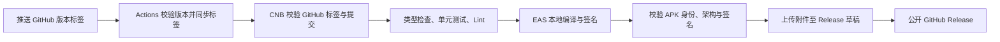

# 发布指南

## 构建方案

Lunar 使用 GitHub Actions 检查代码并同步发布标签，CNB 执行 Android 编译，再通过 GitHub API 上传至 GitHub Release。现有 CNB 配置申请 16 核执行资源，并保留 Android SDK、Gradle 和 Cargo 下载缓存，适合包含 Rust 与 C++ 的 Rito 原生构建。

GitHub Actions 也能完成 Android 编译。公开仓库的标准 Linux 执行器提供 4 核、16 GB 内存和 14 GB SSD，优点是代码、日志与发布均集中在 GitHub。当前方案复用项目现有 CNB 构建环境；实际耗时还受 CNB 配额、排队和缓存状态影响。[GitHub 执行器规格](https://docs.github.com/en/actions/reference/runners/github-hosted-runners)

EAS 使用 `--local`，编译发生在 CNB。Expo 账号用于项目校验、签名凭证下载和远程构建编号管理。[EAS 本地构建文档](https://docs.expo.dev/build-reference/local-builds/)

当前发布对象为 Android arm64 APK。`production` 保留 AAB 构建用途；iOS 原生集成需要完成构建与设备验证后再配置发布。

## 开发版与生产版共存

`app.config.ts` 根据 `APP_VARIANT` 设置 Android 包名、应用显示名称和启动链接协议。EAS 的 `development` 配置设置 `APP_VARIANT=development`；`production` 与 `preview` 设置 `APP_VARIANT=production`，`release` 继承 `production`。环境变量省略时使用生产版标识。

| 构建配置 | Android 包名 | 显示名称 | 启动链接协议 |
| --- | --- | --- | --- |
| `development` | `com.lunarain_079.lunar.dev` | `lunar Dev` | `lunar-dev` |
| `production`、`release`、`preview` | `com.lunarain_079.lunar` | `lunar` | `lunar` |

开发版与生产版可以同时安装，书库和设置由各自的应用存储独立保存。`preview` 与生产版共用包名。Expo 开发客户端的自动协议 `exp+lunar` 仅在开发版注册，开发服务器的二维码会打开开发版。现有开发 APK 使用原包名；重新构建并安装开发版后，`.dev` 应用会获得独立的数据目录。

本地 PowerShell 启动开发服务器：

```powershell
$env:APP_VARIANT = 'development'
pnpm start --dev-client
```

本地切换应用变体时，需要先重新生成 Android 工程，使原生包名与 Expo 配置一致。`prebuild --clean` 会替换生成的 `android` 目录，原生定制应保存在配置插件中。在同一个 PowerShell 终端执行：

```powershell
$env:APP_VARIANT = 'development'
pnpm exec expo prebuild --clean --platform android
pnpm android
```

切换生产版时将变量设为 `production`，重新执行 prebuild，再执行 `pnpm android --variant release`。CNB 和 GitHub 的 EAS 构建会根据构建配置生成原生工程。[Expo 应用变体文档](https://docs.expo.dev/build-reference/variants/) 与 [SDK 57 开发客户端配置](https://docs.expo.dev/versions/v57.0.0/sdk/dev-client/) 描述了上述配置方式。

## 执行过程



`.github/workflows/ci.yml` 在分支推送和 Pull Request 时执行检查。`.github/workflows/release.yml` 处理 `v*` 标签及手动标签同步。CNB 的 `tag_push` 使用标签所指提交中的 `.cnb.yml`，因此发布配置必须包含在发布提交中。[CNB 标签事件](https://docs.cnb.cool/en/build/trigger-rule.html)

GitHub Actions 的成功状态表示标签同步成功。编译结果与日志在 CNB 查看；Release 公开表示构建、校验和全部上传完成。

## 首次配置

### GitHub 同步凭证

在 GitHub 仓库的 `Settings → Secrets and variables → Actions` 中配置 `CNB_SECRET`，使用具备 `Umbrae-Labs/lunar` 推送权限的 CNB 令牌。仓库目前存在这个 Secret。

### CNB 发布凭证

现有 `expo.yml` 需要同时授权分支推送与版本标签事件：

```yaml
allow_slugs:
  - Umbrae-Labs/lunar
allow_events:
  - push
  - tag_push

EXPO_TOKEN: '<Expo access token>'
```

这里省略 `allow_branches`，使开发分支与 `v*` 标签能够共用 Expo 凭证。需要限制普通分支时，可以为开发构建与发版构建拆分两个凭证文件。

在私密凭证仓库 `Umbrae-Labs/secrets` 的 `main` 分支中创建 `github-release.yml`：

```yaml
allow_slugs:
  - Umbrae-Labs/lunar
allow_events:
  - tag_push
allow_branches:
  - 'v*'

GITHUB_RELEASE_TOKEN: '<GitHub fine-grained personal access token>'
```

令牌选择 GitHub 仓库 `Saramanda9988/lunar`，授予仓库权限 `Contents: Read and write`，用于读取标签、创建 Release 和上传附件。组织仓库还可能要求组织管理员批准令牌。凭证仅保存在 CNB 私密配置中。[GitHub Release API](https://docs.github.com/en/rest/releases/releases)

CNB 的引用规则同时检查仓库、事件与分支；标签事件的分支值为标签名。现有 `expo.yml` 也需要允许 `Umbrae-Labs/lunar` 的 `tag_push` 事件及 `v*` 标签访问，并继续保留开发构建所需授权。[CNB 文件引用授权](https://docs.cnb.cool/en/build/file-reference.html)

### Expo 签名

现有 `expo.yml` 继续提供 `EXPO_TOKEN`，对应账号应具有项目 `523fd44d-54f4-4bde-9561-e75955b19f4d` 的构建权限。正式 APK 使用 EAS 托管的 Android keystore。

首次发布前，在具备项目访问权限的终端执行：

```sh
pnpm dlx eas-cli@21.8.0 credentials --platform android
```

选择 `release` 配置，确认应用 `com.lunarain_079.lunar` 的签名凭证存在。如果此前曾分发正式 APK，使用相同 keystore 才能覆盖安装。妥善备份签名凭证；keystore、密码和 `credentials.json` 应保存在私密存储中。

## 版本与发布操作

`package.json` 的 `version` 与 `app.json` 的 `expo.version` 使用相同的 `X.Y.Z`。正式标签为 `vX.Y.Z`，预发布标签支持 `vX.Y.Z-alpha.N`、`vX.Y.Z-beta.N` 和 `vX.Y.Z-rc.N`，其中 N 为正整数。例如 `v1.1.0-rc.1` 对应两个配置文件中的 `1.1.0`。

Android `versionCode` 由 EAS 远程管理，每次 release 构建自动递增。重试构建可能消耗新的编号，编号允许存在间隔。APK 的实际编号会记录在发布附件 `release.json` 中。[EAS 版本管理](https://docs.expo.dev/build-reference/app-versions/)

提交版本修改与发布配置后，以 `1.0.0` 为例执行：

```sh
pnpm run check
pnpm run test:release
node scripts/release.mjs validate v1.0.0
git tag -a v1.0.0 -m "Lunar v1.0.0"
git push origin v1.0.0
```

构建成功后，GitHub Release 包含 `lunar-v1.0.0-android-arm64-v8a.apk`、`SHA256SUMS.txt` 与 `release.json`，并自动生成发布说明。预发布标签会设置 GitHub Prerelease 标记。

CI 与 CNB 的 Expo 依赖检查设置 `EXPO_OFFLINE=1`，依据当前安装的 SDK 所附依赖清单执行。日常维护时执行 `pnpm run check:expo` 可查询 Expo 在线推荐版本。构建使用 `pnpm install --frozen-lockfile`，依赖更新应在发布前提交。

## GitHub production 编译测试

`.github/workflows/build-production.yml` 提供独立的 `Build production APK on GitHub` 手动入口。它使用标准 `ubuntu-24.04` 执行器，通过 `eas build --local` 编译 arm64 APK。构建使用继承 `production` 的 `release` 配置，执行正式模式编译与签名。公开仓库使用标准执行器免费；私有仓库消耗账号的 Actions 免费分钟额度，超过额度后的费用由账号计费设置决定。[GitHub 执行器说明](https://docs.github.com/en/actions/reference/runners/github-hosted-runners)

首先将配置文件与依赖修复提交到 GitHub 默认分支，并在仓库 `Settings → Secrets and variables → Actions` 添加 `EXPO_TOKEN`。令牌对应的 Expo 账号需要具有本项目访问权限，Android 签名凭证沿用 EAS 托管配置。CNB 私密配置中的令牌需要单独配置到 GitHub Secret。

在 GitHub 的 `Actions → Build production APK on GitHub → Run workflow` 中选择包含依赖修复的分支，再点击 `Run workflow`。成功后，在该次运行的 `Artifacts` 区域下载 `lunar-production-<运行编号>-<尝试次数>`，其中包含可安装的 `lunar-production.apk`，附件保留 7 天。[GitHub 手动运行说明](https://docs.github.com/en/actions/how-tos/manage-workflow-runs/manually-run-a-workflow)

该任务完成编译与附件上传，日志保存在 GitHub Actions。正式版本发布继续使用现有标签发布任务。继承的 `production.autoIncrement` 会递增 EAS 远程 Android 构建编号。

任务在安装依赖前清理闲置预装工具和 Android 模拟器资源，同时删除 `27.1.12297006` 之外的预装 NDK，并将 NDK 环境变量设置为项目所用版本。构建脚本负责安装所需 NDK。任务输出清理前后的可用空间和各个待清理 NDK 的占用量。

30 GiB 是为 EAS 项目副本、Gradle 缓存及 Rust、C++ 中间文件设置的估算预留值。低于该值时显示提示并继续编译，实际容量需求以构建记录为依据。构建结束后记录磁盘容量、inode 与主要构建目录占用。

## 失败处理

GitHub 同步失败时，修正 `CNB_SECRET` 或仓库权限，再重试 GitHub Actions。也可通过 `Release Android via CNB` 的手动入口输入现有 GitHub 标签。

标签存在于 CNB 时，再次同步相同标签只会确认内容相同。此时在 CNB 构建页面重试对应任务。CNB 发布任务共用执行锁，按顺序编译和发布，等待上限为三小时。

上传中断时，Release 保持草稿；重新执行 CNB 上传步骤会替换本脚本为同一提交创建的草稿附件。构建目录中的 APK 必须仍然存在；目录失效后重试完整构建。公开的 Release 与人工创建的草稿会受到保护，脚本会停止覆盖。后续修正通过新版本标签发布。

如果 GitHub 标签与 CNB 检出的提交存在差异，检查步骤会停止发布。标签同步使用普通推送，强制覆盖标签会被拒绝。

## 本地验证范围

`pnpm run test:release` 通过模拟 GitHub API 验证版本格式、APK 元数据、提交一致性、草稿恢复和上传失败处理。完整签名 APK 编译需要 Linux 或 macOS 构建环境及 Expo 凭证；CI 配置验证和脚本测试之外，首次 CNB 构建还需完成设备安装验证。
